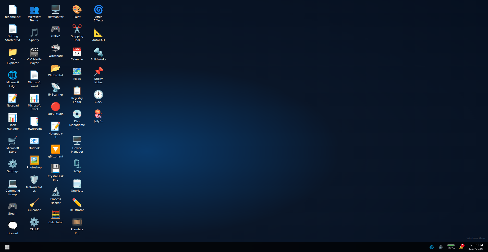
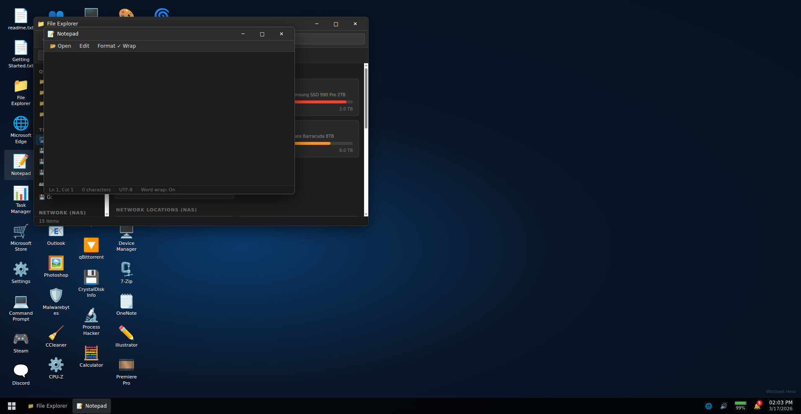

# Windows 10 in Browser

A faithful Windows 10 simulation built in React + TypeScript — runs entirely in the browser with no VM or backend required.

   


*Full desktop with 45+ app shortcuts, taskbar, system tray, and live clock*

## Features

### Desktop & Shell
- Animated boot screen with Windows logo and loading dots
- Windows 10 startup chime (synthesized via Web Audio API — no audio files)
- 24 rotating CSS gradient wallpapers cycling every 5 minutes — all styled to match the Windows 10 Spotlight aesthetic (deep blues, misty peaks, twilight nature scenes)
- Fully functional taskbar with clock, system tray, Start button
- Start menu with 45+ apps, live search, pinned tiles, user panel, and power options
- Window manager — open, minimize, maximize, resize, drag, z-order focus
- `Alt+F4` closes the focused window; `Win/Meta` key toggles Start Menu
- **Right-click context menus** on desktop icons, files, folders, drive cards, title bars, taskbar buttons, and taskbar empty area
- **Aero Snap** — drag a window to the left/right screen edge to snap to half-width; drag to the top edge to maximize
- **Properties dialog** — shows type, location (Windows path), size, item count, created/modified dates
- **Login screen** — Windows-style lock screen with live clock; click to sign in (also unlocks Web Audio)
- **User panel** — Lock and Sign out return to login screen; Change account settings opens Settings > Accounts
- **Click-and-drag rubber-band selection** on the desktop
- Shut down, restart, and sleep animations
- **System-wide dark / light mode** — toggle in Settings → Personalization; defaults to dark; all window chrome responds instantly via CSS variables

### Multi-Monitor Support

Open a second browser tab to simulate a second display. Each tab is a fully independent Windows 10 instance connected via the browser's `BroadcastChannel` API (no server required).

#### Setup
1. Go to **Settings → System → Display** and click **"Open second display"** — a new tab opens
2. In **each tab**, click **"← Left monitor"** or **"Right monitor →"** to declare its position
3. Both tabs show a **● green dot** confirming they are paired; a **pulsing blue edge glow** appears on the connected side of each desktop

#### Dragging windows between monitors
- **Drag any window toward the connected screen edge** — the window slides off your screen just like a physical monitor boundary; no snap, no wall
- As pixels cross the edge, the receiving tab shows a **live phantom window** sliding in from the opposite side — the two images are pixel-perfect synchronized (if 120 px have crossed in Tab A, exactly 120 px are visible in Tab B)
- The phantom's opacity ramps from faint to solid as it enters
- **Release with more than half the window crossed** → full transfer: the window closes on the source tab and opens on the destination tab
- **Release with less than half crossed** → the window snaps back to the screen edge on the source tab; the phantom disappears on the destination tab
- A bright cyan edge flash marks the screen boundary while a window is actively crossing it
- **Aero Snap is disabled on the connected edge** — dragging to that edge always initiates a cross-monitor move instead of half-snapping
- Right-click any window title bar → **"Move to other display"** for an instant one-click transfer without dragging

#### Monitor arrangement (Settings → System → Display)
- Visual diagram shows Monitor 1 (this tab) and Monitor 2 (other tab) side by side in their declared order
- **Swap** which side each tab is on at any time — the phantom and edge glow update immediately
- **Multiple displays** dropdown: Extend / Duplicate / Show only on 1 or 2

### System Tray
- Wi-Fi panel with 10 networks + Bluetooth panel with 4 paired devices
- Volume icon
- **Battery indicator** — drains 100 → 0% over 1 hour; popup shows %, time remaining, and settings link; at 0% plays a fullscreen "stealing your power to recharge" animation then resets to 100%
- **Action Center** — 🔔 bell icon with badge counter; notification panel with 5 pre-seeded notifications (dismiss individually or clear all); Quick Action tiles: Wi-Fi, Bluetooth, Airplane mode, Night light, Quiet hours, All settings
- Real-time clock

### Apps

#### Productivity & Office
| App | Description |
|-----|-------------|
| **File Explorer** | Virtual filesystem — 15 drives (C–G local + 10 NAS), "This PC" drive cards with usage bars, right-click context menu on all items, full Program Files / System32 tree |
| **Notepad** | Reads and writes virtual filesystem files; **📂 Open** button to browse and load any text file; Ctrl+S saves; word wrap toggle |
| **Notepad++** | Tabbed code editor with regex-based syntax highlighting for HTML, CSS, JS, Python, Markdown; **📂 Open** loads any virtual FS file; toolbar wired (New, Save, Undo/Redo, Find, Zoom); click to toggle view/edit mode |
| **Word** | contentEditable rich text editor — bold, italic, underline, alignment, lists, 6 fonts, 14 sizes; **📂 Open** to browse and load .docx / .txt files from virtual FS |
| **Excel** | 26×50 grid with formula evaluation (`SUM`, cell refs, arithmetic); **📂 Open** loads CSV files; **💾 Save** exports CSV; **Undo/Redo** with full history stacks; 3 sheets |
| **PowerPoint** | 3-slide deck; add/delete slides; click-to-edit title and body text; 5 theme colors; **▶ Present** launches fullscreen presentation mode with arrow-key slide navigation |
| **Outlook** | 30+ realistic inbox emails + 500 spam/scam emails; all 5 folders with real filtering; compose sends to Sent; delete, reply, search all work |
| **OneNote** | 3 sections, 4 pre-filled notes; inline editing; add pages |
| **Calculator** | Full arithmetic with decimal, backspace, ±, %; last 5 calculations in history; **Scientific mode** — sin/cos/tan/asin/acos/atan, log/ln/10ˣ/eˣ, √/x²/x³/xʸ, 1/x, \|x\|, n!, π, e; DEG/RAD toggle |
| **Calendar** | Monthly grid with 8 pre-seeded events; add/delete events with title, time, and color |
| **Snipping Tool** | Mode selector, delay picker, annotation toolbar |
| **Paint** | Pencil, eraser, BFS flood fill, **eyedropper** (samples pixel color), line, rectangle, ellipse, text; 20-color palette + custom picker; **Undo/Redo** with full canvas history; **📂 Open Image** loads a real image file; exports PNG |

#### Communication & Media
| App | Description |
|-----|-------------|
| **Discord** | 12 servers with category/channel hierarchies, 30 DM contacts with status/activity, pre-seeded message history, live messaging |
| **Microsoft Teams** | 25 DM contacts, 5 team workspaces with channels, Calendar/Calls/Files views, pre-seeded message history |
| **Spotify** | 6 playlists, 18 songs, live progress bar tied to actual song duration, search, like/unlike tracks |
| **VLC** | 32-item playlist (movies, TV, music videos, audio — mkv/mp4/flac/mp3); **📂 Open File** to add real media files from disk; live playback timer with auto-advance |
| **OBS Studio** | 4 scenes, 3 audio channels with live VU meters; Studio Mode; add/remove/reorder scenes and sources; Settings panel; mic/desktop audio toggles |
| **Sticky Notes** | Multi-note editor with sidebar list; 6 color themes (yellow, blue, green, pink, purple, grey); inline editing; add/delete notes |
| **Clock** | 4 tabs — analog/digital clock face; alarm list with add/toggle/delete; countdown timer with ring progress; stopwatch with lap times |
| **Jellyfin** | Media server UI — Movies (12 titles), TV Shows (3 series with episodes), Music (2 albums); Continue Watching row; full-screen player with scrubber, transport controls, shuffle/repeat |

#### Gaming
| App | Description |
|-----|-------------|
| **Steam** | ~500 real game titles with genre, size, and playtime data; CS2 shown as "Playing"; BG3 has pending update; library filter/search/sort, Store tab, Community tab |
| **qBittorrent** | 521 torrents — 70 detailed entries (Cyberpunk 2077 actively downloading at 2840 KB/s) + 451 Archive.org seeds spanning live music, classical, jazz, blues, texts, newspapers, silent films, documentaries, animation, software, radio, and academic archives; live upload speed animation; torrent detail tabs |

#### System & Monitoring
| App | Description |
|-----|-------------|
| **Task Manager** | Live CPU (measured via `performance.now()`), RAM, Disk, Network with 60-point SVG sparklines; process list with 38 entries |
| **Process Hacker** | 38 base processes with live CPU/memory updates; `cs2.exe` floats 15–45%; End Process blocked for system processes, permanent for user processes; 4 tabs |
| **CrystalDiskInfo** | 4 drives with S.M.A.R.T. attribute tables; temps update every 2s |
| **GPU-Z** | Full RTX 4070 specs; 10 live sensor readings updating every 1s (clock, temp, load, fan, power, VRAM) |
| **CPU-Z** | i7-12700K — CPU, Cache, Mainboard, Memory, GPU tabs with full static readout |
| **HWMonitor** | Live sensor tree — Nuvoton NCT6798D motherboard, i7-12700K cores, RTX 4070, Samsung SSD, DDR5; updates every 1.5s |
| **WinDirStat** | Disk usage analyzer for all 5 local drives + NAS; animated scan path; directory tree + extension list + treemap |
| **Device Manager** | 15 device categories with expand/collapse; notable entries: Logitech MX Master 3, RTX 4070 driver 551.86 |
| **Disk Management** | Disk 0 (SSD 512GB) and Disk 1 (HDD 2TB) partition layout with proportional bars |
| **Registry Editor** | 5 root hives with hundreds of realistic entries (NVIDIA drivers, Steam, Discord, Office, .NET, TCP/IP, USB, fonts); live search across all keys and values |

#### Security & Network
| App | Description |
|-----|-------------|
| **Wireshark** | Random packet capture every 80ms — TCP/UDP/DNS/TLS/HTTP/ARP/ICMP with protocol weights; filter bar; hex dump for selected packet |
| **Malwarebytes** | Scan simulation across 820,000 objects; generates 2,000–10,000 threats; triggers OS restart after clean |
| **CCleaner** | Analyze/clean with animated progress; 20 junk file categories; registry cleaner tab |
| **IP Scanner** | Scans 192.168.1.1–254; discovers 15 devices; "Open in Browser" loads device info page; this PC flagged as .105 |

#### Creative & Design
| App | Description |
|-----|-------------|
| **Photoshop** | Canvas drawing with brush, eraser, **BFS flood fill**, and **eyedropper** (samples pixel color); **📂 Open** loads a real image; 3 layers panel |
| **Illustrator** | Vector canvas — rectangle, ellipse, **line** (drag), **pen path** (click to place points, double-click to finish), **text** (click + prompt); **📂 Open Image** loads reference art; live dashed preview for pen paths |
| **Premiere Pro** | 6 clips on 4 tracks; **live playback timer** — currentTime advances in real-time when playing, stops at sequence end |
| **After Effects** | 4 layers on a 10s composition; **live playback timer** — advances at 0.1s per 100ms tick, stops at 10s; animated playhead |
| **AutoCAD** | Grid-snapped canvas — line, rectangle, circle, **polyline** (click points, double-click to finish with live dashed preview); undo, command history; zoom in/out/reset with coordinate-corrected mouse tracking |
| **SolidWorks** | Interactive 3D box — mouse drag rotates via isometric projection; feature tree |
| **7-Zip** | 3-level filesystem navigation; delete; extract and info toasts |

#### Web & Misc
| App | Description |
|-----|-------------|
| **Browser (Edge)** | Real YouTube iframe; simulated pages for Google, GitHub, Reddit, Wikipedia, Stack Overflow, HN, Netflix, Twitter, router admin UI (192.168.1.1), 15 device info cards (192.168.1.x); **fully functional tabs** (switch, close, new); bookmarks; extensions panel; fake uBlock counter |
| **Settings** | 11 pages — System, Devices, Network, Personalization, Apps, Accounts, Time, Gaming, Ease of Access, Privacy, Update |
| **Windows Store** | 18 apps with category filter, install simulation; WinRAR is the only paid app |
| **Maps** | Simulated NYC map with CSS roads, 6 landmark markers, map/satellite toggle |
| **CMD / PowerShell** | 20+ commands: `dir`, `cd`, `ipconfig /all`, `ping`, `tracert`, `systeminfo`, `tasklist`, `netstat`, `tree`, `mkdir`, `color`, and more |

### Windows Update Simulation
1. **Check for updates** — spins 4–8 seconds
2. Finds 2–5 randomly selected updates (Security, Driver, Cumulative, Definition)
3. **Download phase** — 15–40 seconds with animated progress bar
4. **Install phase** — 15–30 seconds with per-update status
5. Plays a completion chime; shows **Restart now** banner
6. Clicking restart triggers the full OS reboot animation
- Full update history with KB numbers and March 2026 dates
- Delivery Optimization stats, Pause updates, Active hours toggles

### Virtual Filesystem

Persisted to `localStorage` — survives page refresh.

#### Local Drives (C–G)
| Drive | Hardware | Size |
|-------|----------|------|
| C: | Samsung SSD 990 Pro | 512 GB |
| D: | Samsung SSD 990 Pro | 2 TB |
| E: | WD Black SN850X | 2 TB |
| F: | Seagate Barracuda | 8 TB |
| G: | Crucial P5 Plus | 1 TB |

Includes 90+ game install folders, full Program Files tree (40+ apps), System32 (50+ executables and control panel applets), and a rich `C:\Users\User\` tree:

- **Documents** — journal, stories, homework, work notes, interview prep, recipes, goals
- **Documents\Office Documents\Word Documents** — resume, cover letter, technical spec, novel draft, business plan, research notes, letter of recommendation
- **Documents\Office Documents\Excel Spreadsheets** — budget, project tracker, sales data
- **Documents\Office Documents\CSV Data** — 8 ready-to-load CSV files: employees (20 rows), monthly sales (12 months), student grades (15 students × 6 subjects), inventory (15 SKUs), budget vs actual, website analytics, stock portfolio, project timeline
- **Documents\Code Projects** — `server.py` (Flask API), `schema.sql` (PostgreSQL), `Dockerfile`, `useAuth.ts`, `Dashboard.tsx`, `algorithms.py`, `nginx.conf`, `test_api.py`, `Component.vue`
- **Downloads** — installers, PDFs, zip files
- **Pictures** — vacation photos, screenshots, wallpapers
- **Music / Videos** — playlists, watchlists, clip notes

#### NAS Drives (N/P/Q/R/S/T/U/V/W/Z)

| Drive | Label | Hardware | Size |
|-------|-------|----------|------|
| N: | NAS-Media | Synology DS1823xs+ | 96 TB |
| P: | NAS-Personal | Synology DS1621+ | 72 TB |
| Q: | NAS-Seeds1 | Synology RS4021xs+ | 144 TB |
| R: | NAS-Seeds2 | Custom 24-bay | 192 TB |
| S: | NAS-Seeds3 | SuperMicro JBOD | 256 TB |
| T: | NAS-Seeds4 | NetApp FAS8700 | 320 TB |
| U: | NAS-Seeds5 | Supermicro | 480 TB |
| V: | NAS-Seeds6 | Dell PowerEdge | 576 TB |
| W: | NAS-Seeds7 | HPE ProLiant | 384 TB |
| Z: | NAS-Archive | QNAP TS-873A | 48 TB |

Content spans live music archives, classical/jazz/blues recordings, silent films, documentaries, animation, software, radio broadcasts, academic papers, digitised texts and newspapers — mirroring a real Archive.org seeding setup.

### Right-Click Context Menus

Right-click menus are implemented across the entire UI:

| Surface | Menu items |
|---------|-----------|
| **Empty desktop** | View, Sort by, Refresh, Display settings, Personalize |
| **App shortcut** | Open, Properties |
| **File or folder** | Open, Open with Notepad, Rename, Delete, Properties |
| **Drive card (This PC)** | Open, Properties |
| **Empty folder area** | New Folder, New File, Refresh, Properties of current folder |
| **Window title bar** | Restore, Move, Size, Minimize, Maximize, Move to other display, Close (Windows system menu) |
| **Taskbar button** | Restore/Minimize, Maximize/Restore down, Close window |
| **Empty taskbar area** | Taskbar settings |
| **Registry Editor tree node** | Copy Key Name, New Key, Delete, Rename |
| **Registry Editor value row** | Copy Name, Copy Data, Modify, Delete |
| **Excel cell** | Cut, Copy, Paste, Clear Cell |

**Properties dialog** shows: type, full Windows-style path (`C:\Users\User\Documents`), file size in bytes/KB/MB, item count for folders, created and modified timestamps.


*Multiple apps running simultaneously with the window manager*

## Tech Stack

- **React 18** + **TypeScript** (strict)
- **Vite 5** — dev server and production build
- **Zustand** — window manager, filesystem, desktop, theme, display/multi-monitor state
- **BroadcastChannel API** — cross-tab communication for multi-monitor window transfer and live phantom sync
- **Web Audio API** — all sounds synthesized at runtime; no audio files
- **Plain CSS** per component — no CSS framework; no image assets

## Running Locally

```bash
cd win10-app
npm install
npm run dev
```

Open http://localhost:5173

## Docker

```bash
docker compose up -d
```

Open http://localhost:3000

The Docker image is automatically built and pushed to `ghcr.io/atvriders/windows-in-browser:latest` on every push to `master`.

## Project Structure

```
win10-app/src/
├── apps/              # 45 app components, each with its own CSS
├── components/
│   ├── Boot/          # BootScreen, ShutdownScreen
│   ├── ContextMenu/   # Right-click menu component
│   ├── Desktop/       # Desktop, DesktopIcon, wallpaper logic
│   ├── PropertiesDialog/  # File/folder properties modal
│   ├── StartMenu/     # Start menu with search and pinned tiles
│   ├── Taskbar/       # SystemTray, battery, Wi-Fi/BT panel, clock
│   └── Window/        # Window chrome, TitleBar, drag/resize handles
├── filesystem/        # FileSystemDriver.ts, initialTree.ts (15 drives)
├── store/             # Zustand stores: windows, filesystem, desktop, theme, display
├── types/             # AppID union, FSNode, WindowInstance interfaces
└── utils/             # sounds.ts (Web Audio), displayChannel.ts (BroadcastChannel helpers)
```
